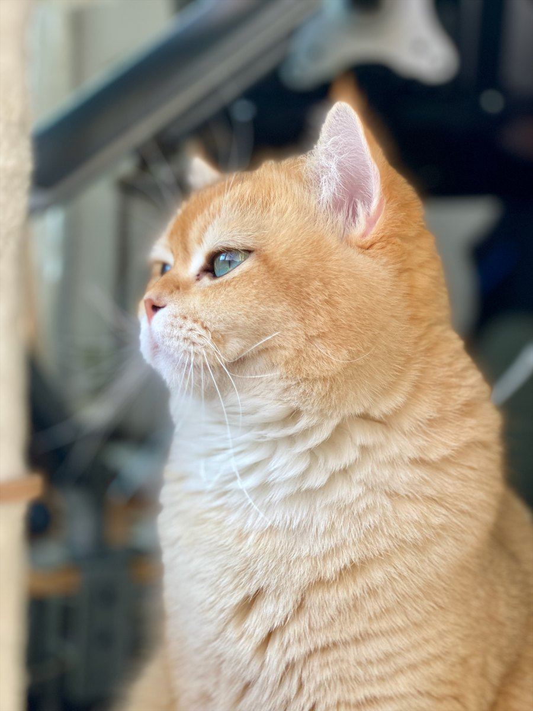
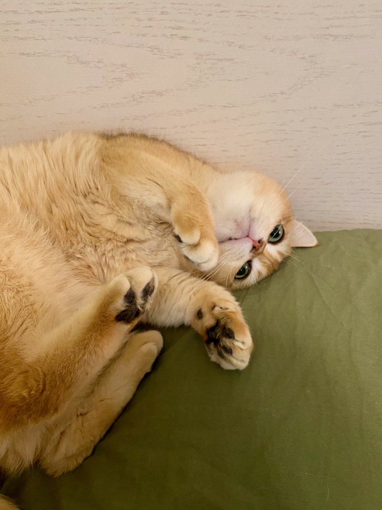
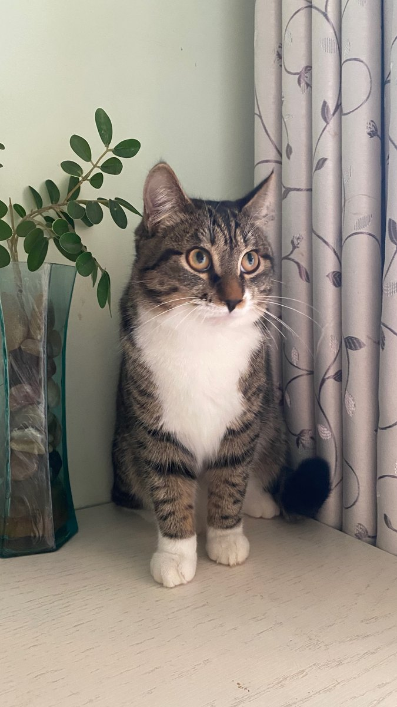
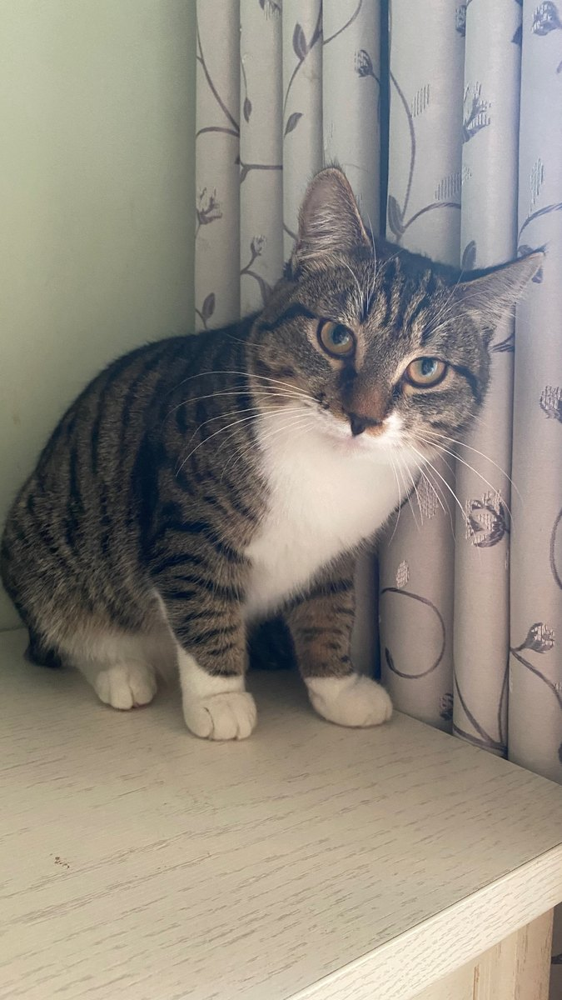
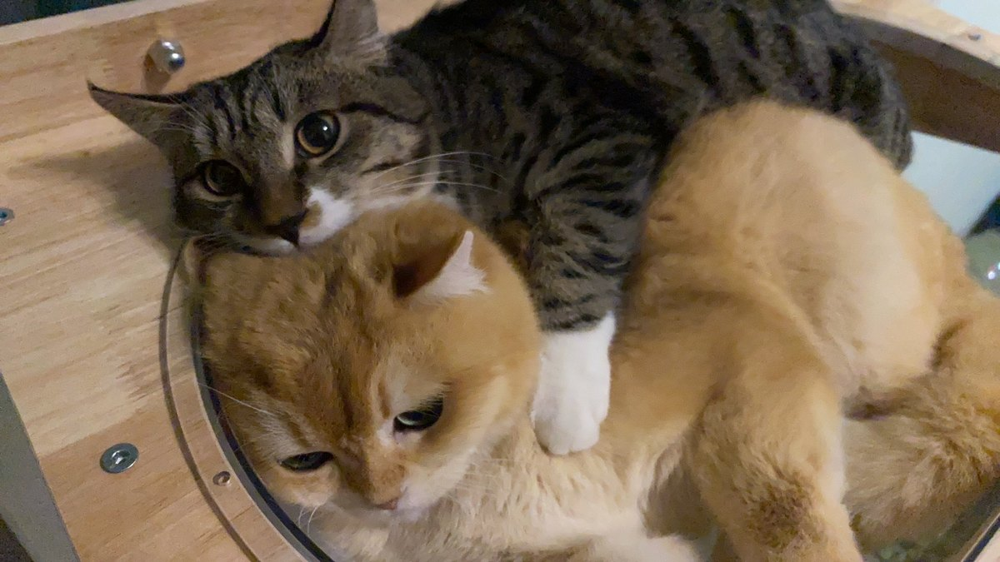

# miniviking

[English](README.md)

`miniviking` 是一个为 OpenViking 准备的轻量本地 MLX 服务器。它在 localhost 上开放 OpenAI 兼容接口，让原版 OpenViking 几乎不需要额外配置，就能使用本地聊天大模型和 embedding 模型。

默认接口：

```text
http://127.0.0.1:8745/v1
```

端点：

- `GET /v1/models`
- `POST /v1/chat/completions`
- `POST /v1/embeddings`
- `GET /health`

## 安装

```sh
brew tap le0-VV/miniviking https://github.com/le0-VV/miniviking
brew install le0-VV/miniviking/miniviking
```

创建 Homebrew service 使用的配置，并下载选中的模型：

```sh
miniviking install --config "$(brew --prefix)/etc/miniviking/config.json" --skip-launch-agent
```

启动 Homebrew service：

```sh
brew services start miniviking
```

验证正在运行的服务：

```sh
miniviking test --config "$(brew --prefix)/etc/miniviking/config.json"
```

作为当前用户的 LaunchAgent 安装：

```sh
miniviking install
miniviking start
```

直接运行：

```sh
miniviking serve
```

验证正在运行的服务：

```sh
miniviking test
```

输出当前 miniviking 配置对应的 OpenViking 配置片段：

```sh
miniviking openviking-config
```

安装时会检测主机内存，并把配置写入 `~/.miniviking/config.json`。在低于 12 GB 统一内存的机器上，`miniviking install` 默认使用 `mode=embedding`，只下载 embedding 模型，并拒绝本地 LLM 模式。这些机器需要在 OpenViking 中单独配置 LLM provider，例如使用 API provider。

端口、运行模式和模型都可以在配置文件里修改，也可以在安装时通过 CLI 参数自定义。

内存档位默认值：

| 统一内存       | 默认模式    | 嵌入模型                                 | 本地 LLM 默认值                              | 后端      |
| -------------- | ----------- | ---------------------------------------- | -------------------------------------------- | --------- |
| 低于 12 GB     | `embedding` | `mlx-community/embeddinggemma-300m-4bit` | 不支持；需要单独配置 OpenViking LLM provider | N/A       |
| 12 GB 到 16 GB | `both`      | `mlx-community/embeddinggemma-300m-4bit` | `mlx-community/gemma-4-e2b-it-4bit`          | `mlx-vlm` |
| 高于 16 GB     | `both`      | `mlx-community/embeddinggemma-300m-4bit` | `mlx-community/gemma-4-e4b-it-4bit`          | `mlx-vlm` |

初始上下文和吞吐限制刻意低于各模型的最大上下文窗口：

| 档位   | `max_kv_size` | 近似 prompt 上限 | 最大输出 token | 嵌入批大小 |
| ------ | ------------: | ---------------: | -------------: | ---------: |
| Small  |          8192 |             8192 |            512 |          2 |
| Medium |          8192 |             8192 |            768 |          4 |
| Large  |          8192 |             8192 |           1024 |          8 |

OpenViking 的 OpenAI 兼容 provider 设置应该指向：

```text
api_base = "http://127.0.0.1:8745/v1"
api_key = "unused"
```

在默认的低于 12 GB embedding-only 安装中，`miniviking openviking-config` 只会输出 embedding provider 配置。OpenViking 的 LLM provider 需要另行配置，例如使用 API provider。

在 12 GB 或更高内存的机器上，Miniviking 会检测原版 OpenViking v2 记忆抽取请求，通过 Gemma memory adapter 压缩提示词，并返回 OpenViking 兼容的记忆操作。

内部 RC 验证：

## 👉👈

如果 miniviking 有帮到你，或者你刚好想支持一下，欢迎请我喝杯奶茶。哪怕1分钱对我来说也是莫大的鼓励。


还有 bro 现在真的没有收入 💀。你的投喂会养活我的两只毛孩子：Jessie 和 Yolo <3

完全自愿。不影响 license、issue 优先级、feature 优先级，也不代表任何 support SLA。

### Jessie 和 Yolo

| Jessie 第一天                                                                | Jessie                                                        | 还是 Jessie                                                        |
| ---------------------------------------------------------------------------- | ------------------------------------------------------------- | ------------------------------------------------------------------ |
|  |  |  |

| 小小 Yolo                                                         | Yolo                                                      | 还是 Yolo                                                      | Jessie 和 Yolo                                                                      |
| ----------------------------------------------------------------- | --------------------------------------------------------- | -------------------------------------------------------------- | ----------------------------------------------------------------------------------- |
|  |  |  |  |
